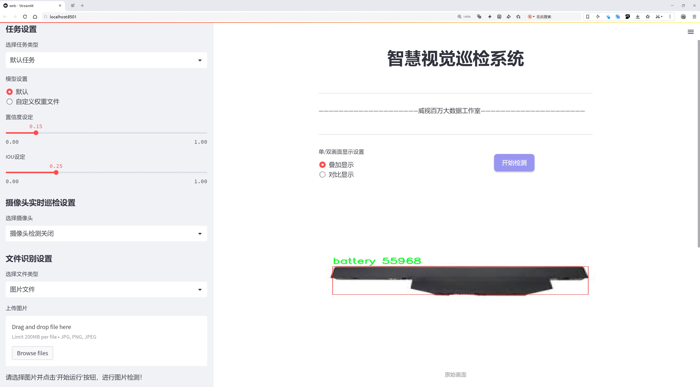
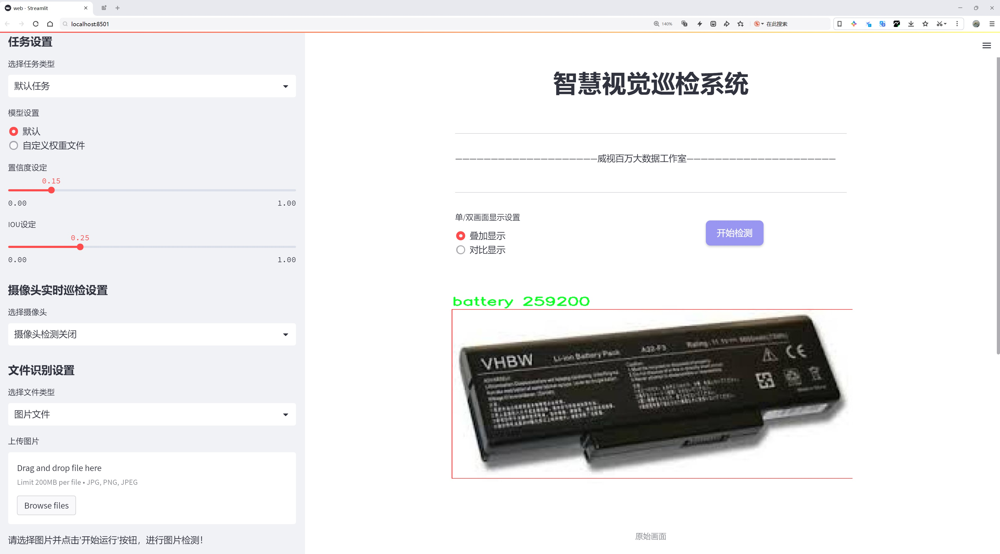
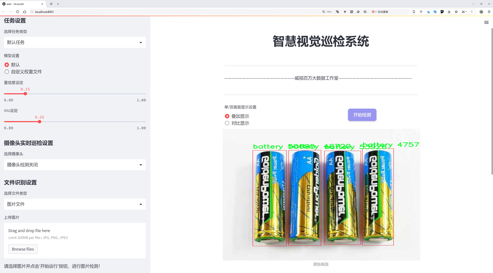
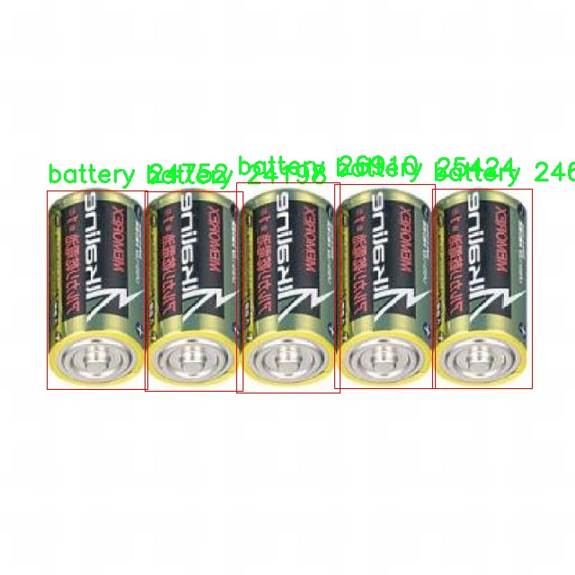
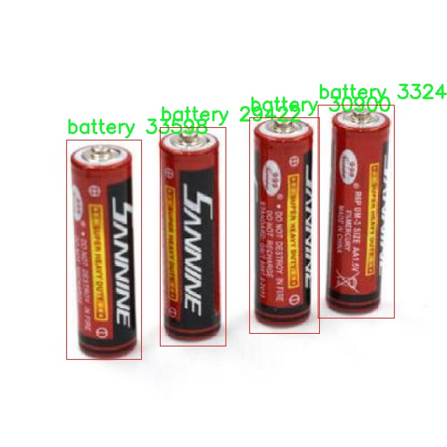
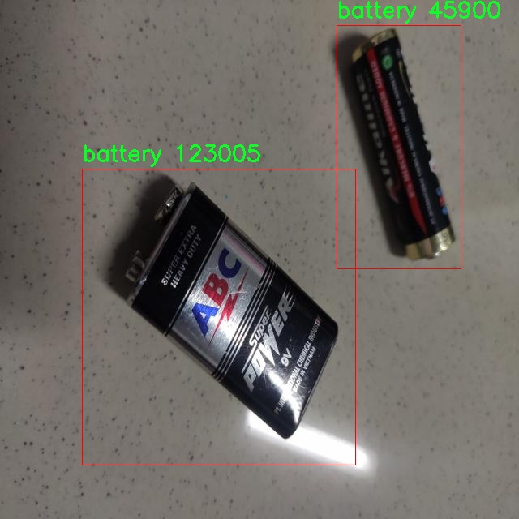

# 电池类型检测检测系统源码分享
 # [一条龙教学YOLOV8标注好的数据集一键训练_70+全套改进创新点发刊_Web前端展示]

### 1.研究背景与意义

项目参考[AAAI Association for the Advancement of Artificial Intelligence](https://gitee.com/qunshansj/projects)

项目来源[AACV Association for the Advancement of Computer Vision](https://gitee.com/qunmasj/projects)

研究背景与意义

随着可再生能源和电动交通工具的迅速发展，电池作为现代社会中不可或缺的能源存储装置，其种类和应用范围日益广泛。电池的分类不仅涉及到不同的化学成分和结构设计，还包括其在不同环境和使用条件下的性能表现。传统的电池分类方法多依赖人工识别，效率低下且容易出错，无法满足现代社会对电池管理和回收的高效需求。因此，开发一种基于计算机视觉的自动化电池类型检测系统显得尤为重要。

本研究旨在基于改进的YOLOv8模型，构建一个高效的电池类型检测系统。YOLO（You Only Look Once）系列模型因其高效的实时目标检测能力而受到广泛关注。YOLOv8作为该系列的最新版本，具有更强的特征提取能力和更快的推理速度，适合于复杂环境下的目标检测任务。通过对YOLOv8的改进，我们希望能够提高电池类型检测的准确性和鲁棒性，从而为电池的分类、管理和回收提供有效的技术支持。

在本研究中，我们使用的数据集包含1800张图像，涵盖了六种不同类型的电池，包括9V电池、AA电池、干电池以及危险电池等。这些类别的选择不仅反映了市场上常见的电池类型，也考虑到了不同电池在环境保护和安全管理中的重要性。尤其是危险电池的识别，对于减少环境污染和提升安全性具有重要意义。通过对这些图像的标注和处理，我们能够为YOLOv8模型的训练提供丰富的样本数据，从而提高模型的泛化能力。

本研究的意义不仅在于技术层面的创新，更在于其在实际应用中的广泛前景。随着电池使用量的增加，电池的回收和处理问题日益突出。通过实现高效的电池类型检测系统，我们能够在电池回收站、废弃物处理中心等场所，快速识别和分类不同类型的电池，从而提高回收效率，降低环境风险。此外，该系统还可以应用于电池生产企业，实现生产过程中的质量控制和产品追溯，进一步推动电池行业的可持续发展。

综上所述，基于改进YOLOv8的电池类型检测系统的研究，不仅具有重要的学术价值，还具有显著的社会意义。通过该系统的开发与应用，我们期望能够为电池管理、回收及环境保护提供新的解决方案，推动相关领域的技术进步与产业发展。

### 2.图片演示







##### 注意：由于此博客编辑较早，上面“2.图片演示”和“3.视频演示”展示的系统图片或者视频可能为老版本，新版本在老版本的基础上升级如下：（实际效果以升级的新版本为准）

  （1）适配了YOLOV8的“目标检测”模型和“实例分割”模型，通过加载相应的权重（.pt）文件即可自适应加载模型。

  （2）支持“图片识别”、“视频识别”、“摄像头实时识别”三种识别模式。

  （3）支持“图片识别”、“视频识别”、“摄像头实时识别”三种识别结果保存导出，解决手动导出（容易卡顿出现爆内存）存在的问题，识别完自动保存结果并导出到tempDir中。

  （4）支持Web前端系统中的标题、背景图等自定义修改，后面提供修改教程。

  另外本项目提供训练的数据集和训练教程,暂不提供权重文件（best.pt）,需要您按照教程进行训练后实现图片演示和Web前端界面演示的效果。

### 3.视频演示

[3.1 视频演示](https://www.bilibili.com/video/BV1kK4BeqE6y/)

### 4.数据集信息展示

##### 4.1 本项目数据集详细数据（类别数＆类别名）

nc: 1
names: ['battery']


##### 4.2 本项目数据集信息介绍

数据集信息展示

在本研究中，我们采用了名为“batteries”的数据集，以训练和改进YOLOv8模型，专注于电池类型的检测。该数据集专为电池识别任务而设计，具有高度的针对性和实用性，旨在提升计算机视觉系统在电池分类和识别方面的准确性和效率。数据集的类别数量为1，具体类别为“battery”，这意味着所有的数据样本均围绕电池这一单一类别展开，确保了模型在电池检测任务中的专注性和深度。

“batteries”数据集的构建考虑到了多样性和代表性，涵盖了不同类型、形状和尺寸的电池样本。这些样本可能包括常见的锂离子电池、镍氢电池、铅酸电池等多种电池类型，虽然在类别上统一为“battery”，但在图像内容上却呈现出丰富的多样性。这种多样性不仅有助于提高模型的泛化能力，还能使其在实际应用中更具适应性，能够处理各种环境下的电池检测任务。

数据集中的图像经过精心挑选和标注，确保每个样本都准确反映了电池的特征。标注过程采用了严格的标准，确保了数据的高质量和高准确性。每张图像都经过专业人员的审核，确保电池的边界框标注精确，避免了因标注错误而导致的训练偏差。这一过程的严谨性为后续模型训练提供了坚实的基础，使得YOLOv8在学习过程中能够获得清晰的目标信息，从而提升检测性能。

此外，数据集的图像来源广泛，涵盖了不同的拍摄条件和背景。这种多样化的环境设置使得模型在训练过程中能够学习到不同光照、角度和背景下电池的特征，从而增强其在实际应用中的鲁棒性。例如，数据集中可能包含在室内、室外、白天和夜晚等不同环境下拍摄的电池图像，这种丰富的场景变化将使得训练后的模型能够更好地适应各种实际应用场景。

为了进一步提升模型的性能，数据集还包含了一些图像增强技术生成的样本。这些增强样本通过旋转、缩放、翻转和颜色调整等方式，增加了数据集的多样性，帮助模型在面对未见过的样本时，依然能够保持较高的检测准确率。这种数据增强策略不仅提高了模型的训练效率，还有效降低了过拟合的风险，使得最终模型在实际应用中能够展现出更强的适应能力。

总之，“batteries”数据集为YOLOv8的电池类型检测系统提供了一个高质量、专注且多样化的训练基础。通过充分利用该数据集的特性，我们期望能够显著提升电池检测的准确性和效率，为电池管理和回收等相关领域的应用提供强有力的技术支持。随着电池技术的不断发展和应用范围的扩大，准确高效的电池检测系统将变得愈发重要，而“batteries”数据集正是实现这一目标的重要一步。








### 5.全套项目环境部署视频教程（零基础手把手教学）

[5.1 环境部署教程链接（零基础手把手教学）](https://www.ixigua.com/7404473917358506534?logTag=c807d0cbc21c0ef59de5)


[5.2 安装Python虚拟环境创建和依赖库安装视频教程链接（零基础手把手教学）](https://www.ixigua.com/7404474678003106304?logTag=1f1041108cd1f708b01a)

### 6.手把手YOLOV8训练视频教程（零基础小白有手就能学会）

[6.1 手把手YOLOV8训练视频教程（零基础小白有手就能学会）](https://www.ixigua.com/7404477157818401292?logTag=d31a2dfd1983c9668658)

### 7.70+种全套YOLOV8创新点代码加载调参视频教程（一键加载写好的改进模型的配置文件）

[7.1 70+种全套YOLOV8创新点代码加载调参视频教程（一键加载写好的改进模型的配置文件）](https://www.ixigua.com/7404478314661806627?logTag=29066f8288e3f4eea3a4)

### 8.70+种全套YOLOV8创新点原理讲解（非科班也可以轻松写刊发刊，V10版本正在科研待更新）

由于篇幅限制，每个创新点的具体原理讲解就不一一展开，具体见下列网址中的创新点对应子项目的技术原理博客网址【Blog】：


[8.1 70+种全套YOLOV8创新点原理讲解链接](https://gitee.com/qunmasj/good)

### 9.系统功能展示（检测对象为举例，实际内容以本项目数据集为准）

图9.1.系统支持检测结果表格显示

  图9.2.系统支持置信度和IOU阈值手动调节

  图9.3.系统支持自定义加载权重文件best.pt(需要你通过步骤5中训练获得)

  图9.4.系统支持摄像头实时识别

  图9.5.系统支持图片识别

  图9.6.系统支持视频识别

  图9.7.系统支持识别结果文件自动保存

  图9.8.系统支持Excel导出检测结果数据


### 10.原始YOLOV8算法原理

原始YOLOv8算法原理

YOLOv8算法作为YOLO系列的最新版本，延续了其前身YOLOv5和YOLOv7的设计理念，同时在多个方面进行了创新和改进。该算法的架构依然由输入层、主干网络、特征融合层和解耦头组成，但在具体实现上，YOLOv8通过引入新的模块和结构，显著提升了目标检测的精度和速度。

在YOLOv8的主干网络中，依旧采用了YOLOv5的CSPDarknet思想，但对C3模块进行了替换，采用了C2f模块。这一变化不仅实现了模型的轻量化，还在保持检测精度的同时，增强了特征提取的能力。C2f模块的设计灵感来源于YOLOv7的ELAN结构，具有两个分支的特性，使得特征的流动更加丰富。具体而言，C2f模块通过将输入特征图分为两个分支，第一条分支直接进行特征拼接，而第二条分支则通过一系列Bottleneck网络进行处理。这种设计有效缓解了深层网络中的梯度消失问题，增强了浅层特征的重用能力，从而提升了模型的整体性能。

在特征融合层，YOLOv8采用了PAN-FPN结构，这一结构的优势在于能够充分融合不同层次的特征信息。通过自下而上的融合方式，YOLOv8能够将高层特征与中层和浅层特征进行有效结合，进而提升对不同尺度目标的检测能力。与YOLOv5相比，YOLOv8在上采样阶段删除了1x1卷积，直接将高层特征上采样后与中层特征进行拼接，这一简化的过程不仅加快了计算速度，还提高了特征融合的效率。

YOLOv8在目标检测中引入了Anchor-Free的思想，摒弃了传统的Anchor-Based方法。这一创新使得模型在处理不同形状和大小的目标时更加灵活，减少了对先验框的依赖，从而提升了检测的准确性。此外，YOLOv8采用了Task-Aligned的样本匹配策略，进一步优化了训练过程中的样本分配，确保了模型在不同任务下的适应性。

在损失函数方面，YOLOv8使用了VFLLoss作为分类损失，DFLLoss和CIoULoss作为回归损失。这些损失函数的设计旨在解决样本不平衡和难以分类样本的问题，特别是在处理小目标时，Focal Loss的引入有效提升了模型对困难样本的关注度，进而改善了整体检测性能。

YOLOv8的Head部分借鉴了YOLOX和YOLOv6的解耦头结构，取消了objectness分支，采用了边框回归和目标分类的分离设计。这一设计使得模型在进行边框回归时能够更加专注于目标的位置信息，而在进行分类时则能够充分利用特征图的语义信息。YOLOv8的Head输出三个不同尺度的特征图，分别为80x80、40x40和20x20，这种多尺度的输出方式确保了模型在处理不同大小目标时的有效性。

在数据预处理方面，YOLOv8沿用了YOLOv5的策略，采用了包括马赛克增强、混合增强、空间扰动和颜色扰动等多种增强手段，以提升模型的鲁棒性和泛化能力。尽管本文未启用数据预处理，但这些增强手段在实际应用中被证明能够有效提升模型的性能。

总的来说，YOLOv8算法通过一系列的结构优化和创新设计，在目标检测领域取得了显著的进展。其轻量化的特征提取模块、有效的特征融合策略以及灵活的样本匹配方法，使得YOLOv8在检测精度和速度上均表现出色，成为当前目标检测任务中的一项重要工具。随着YOLOv8的不断发展和应用，未来的研究将可能进一步探索其在不同领域的适用性和潜力，为目标检测技术的进步提供新的动力。


### 11.项目核心源码讲解（再也不用担心看不懂代码逻辑）

#### 11.1 70+种YOLOv8算法改进源码大全和调试加载训练教程（非必要）\ultralytics\utils\benchmarks.py

以下是经过精简和注释的核心代码部分，主要包括 `benchmark` 函数和 `ProfileModels` 类。代码中去掉了不必要的部分，并对每个关键步骤进行了详细的中文注释。

```python
import time
import numpy as np
import pandas as pd
from pathlib import Path
from ultralytics import YOLO
from ultralytics.utils import select_device, check_requirements, check_yolo, file_size

def benchmark(model='yolov8n.pt', imgsz=160, half=False, int8=False, device='cpu', verbose=False):
    """
    基准测试 YOLO 模型在不同格式下的速度和准确性。

    参数:
        model (str): 模型文件路径，默认为 'yolov8n.pt'。
        imgsz (int): 基准测试使用的图像大小，默认为 160。
        half (bool): 是否使用半精度模型，默认为 False。
        int8 (bool): 是否使用 int8 精度模型，默认为 False。
        device (str): 运行基准测试的设备，默认为 'cpu'。
        verbose (bool): 是否详细输出基准测试信息，默认为 False。

    返回:
        df (pandas.DataFrame): 包含每种格式的基准测试结果的 DataFrame。
    """
    pd.options.display.max_columns = 10
    pd.options.display.width = 120
    device = select_device(device, verbose=False)  # 选择设备
    model = YOLO(model)  # 加载模型

    results = []  # 存储结果
    start_time = time.time()  # 记录开始时间

    # 遍历不同的导出格式
    for i, (name, format, suffix, cpu, gpu) in export_formats().iterrows():
        emoji, filename = '❌', None  # 默认导出状态
        try:
            # 检查导出格式的支持性
            if 'cpu' in device.type:
                assert cpu, 'CPU 不支持此推理'
            if 'cuda' in device.type:
                assert gpu, 'GPU 不支持此推理'

            # 导出模型
            if format == '-':
                filename = model.ckpt_path or model.cfg  # PyTorch 格式
            else:
                filename = model.export(imgsz=imgsz, format=format, half=half, int8=int8, device=device, verbose=False)
                exported_model = YOLO(filename, task=model.task)  # 加载导出的模型
                assert suffix in str(filename), '导出失败'
            emoji = '✅'  # 导出成功

            # 进行推理
            exported_model.predict(ASSETS / 'bus.jpg', imgsz=imgsz, device=device, half=half)

            # 验证模型
            data = TASK2DATA[model.task]  # 获取数据集
            key = TASK2METRIC[model.task]  # 获取评估指标
            results = exported_model.val(data=data, batch=1, imgsz=imgsz, device=device, half=half, int8=int8, verbose=False)
            metric, speed = results.results_dict[key], results.speed['inference']  # 获取指标和推理速度
            results.append([name, '✅', round(file_size(filename), 1), round(metric, 4), round(speed, 2)])
        except Exception as e:
            if verbose:
                assert type(e) is AssertionError, f'基准测试失败: {e}'
            results.append([name, emoji, round(file_size(filename), 1), None, None])  # 记录失败结果

    # 打印结果
    check_yolo(device=device)  # 打印系统信息
    df = pd.DataFrame(results, columns=['格式', '状态', '大小 (MB)', '指标', '推理时间 (ms/im)'])
    print(df)  # 输出结果 DataFrame
    return df

class ProfileModels:
    """
    用于分析不同模型在 ONNX 和 TensorRT 上性能的类。

    属性:
        paths (list): 要分析的模型路径列表。
        imgsz (int): 在分析中使用的图像大小，默认为 640。
    """

    def __init__(self, paths: list, imgsz=640, device=None):
        self.paths = paths  # 模型路径
        self.imgsz = imgsz  # 图像大小
        self.device = device or torch.device(0 if torch.cuda.is_available() else 'cpu')  # 选择设备

    def profile(self):
        """分析模型性能并打印结果。"""
        files = self.get_files()  # 获取模型文件

        if not files:
            print('未找到匹配的模型文件。')
            return

        for file in files:
            model = YOLO(str(file))  # 加载模型
            model_info = model.info()  # 获取模型信息
            onnx_file = model.export(format='onnx', imgsz=self.imgsz, device=self.device, verbose=False)  # 导出 ONNX 模型

            # 进行 ONNX 模型性能分析
            t_onnx = self.profile_onnx_model(str(onnx_file))
            print(f'{file.stem}: ONNX 模型速度: {t_onnx[0]:.2f} ms ± {t_onnx[1]:.2f} ms')  # 输出速度

    def get_files(self):
        """返回用户提供的所有相关模型文件的路径列表。"""
        files = []
        for path in self.paths:
            path = Path(path)
            if path.is_dir():
                files.extend(path.glob('*.onnx'))  # 获取目录下的 ONNX 文件
            elif path.suffix == '.onnx':
                files.append(str(path))  # 添加单个文件
        return [Path(file) for file in sorted(files)]  # 返回文件路径列表

    def profile_onnx_model(self, onnx_file: str):
        """分析 ONNX 模型的性能并返回平均运行时间和标准差。"""
        check_requirements('onnxruntime')  # 检查 ONNX 运行时依赖
        import onnxruntime as ort

        sess = ort.InferenceSession(onnx_file)  # 创建 ONNX 会话
        input_tensor = sess.get_inputs()[0]  # 获取输入张量
        input_data = np.random.rand(*input_tensor.shape).astype(np.float32)  # 生成随机输入数据

        # 进行多次推理以测量时间
        run_times = []
        for _ in range(10):  # 进行 10 次推理
            start_time = time.time()
            sess.run(None, {input_tensor.name: input_data})  # 执行推理
            run_times.append((time.time() - start_time) * 1000)  # 记录推理时间

        return np.mean(run_times), np.std(run_times)  # 返回平均时间和标准差
```

### 主要功能
1. **benchmark 函数**：用于对 YOLO 模型进行基准测试，支持不同格式的导出和推理，返回测试结果的 DataFrame。
2. **ProfileModels 类**：用于分析不同模型的性能，支持 ONNX 格式的模型，输出模型的推理速度。

### 代码注释
- 每个函数和类都有详细的中文注释，解释其功能、参数和返回值。
- 关键步骤（如模型加载、导出、推理等）都有注释，便于理解代码的执行流程。

这个文件是Ultralytics YOLO（You Only Look Once）模型的基准测试工具，主要用于评估不同格式的YOLO模型在速度和准确性方面的性能。文件中包含了两个主要的类和一些函数，分别用于基准测试和模型性能分析。

首先，文件开头提供了如何使用这个模块的示例。用户可以通过导入`ProfileModels`和`benchmark`函数来对YOLO模型进行基准测试。支持的模型格式包括PyTorch、TorchScript、ONNX、OpenVINO、TensorRT等，用户可以通过指定不同的格式参数来导出和测试模型。

接下来是`benchmark`函数，它的主要功能是对指定的YOLO模型进行基准测试。函数的参数包括模型路径、数据集、图像大小、是否使用半精度和INT8精度、设备类型（CPU或GPU）等。函数内部会加载模型，并遍历支持的导出格式，对每种格式进行模型导出和推理测试。测试结果包括模型文件大小、准确性指标（如mAP）和推理时间，并将结果存储在一个Pandas DataFrame中。最后，基准测试的结果会被打印出来并记录到日志文件中。

文件中还定义了`ProfileModels`类，用于对多个模型进行性能分析。这个类的构造函数接收模型路径、计时运行次数、预热运行次数、最小运行时间、图像大小等参数。`profile`方法会遍历指定的模型文件，导出ONNX和TensorRT格式的模型，并分别对这两种格式进行性能测试。性能测试包括测量模型的平均运行时间和标准差，并将结果以表格形式输出。

在性能测试中，`profile_tensorrt_model`和`profile_onnx_model`方法分别用于分析TensorRT和ONNX模型的运行时间。它们会进行预热运行以提高测试的准确性，然后执行多次推理以获取平均推理时间和标准差。`iterative_sigma_clipping`方法用于对运行时间数据进行迭代的sigma剪切，以去除异常值。

此外，`generate_table_row`和`generate_results_dict`方法用于生成表格行和结果字典，分别包含模型的名称、参数、GFLOPs（每秒浮点运算次数）和速度指标。`print_table`方法则用于格式化并打印比较表，展示不同模型的性能数据。

总的来说，这个文件提供了一套完整的工具，用于评估和比较YOLO模型在不同格式下的性能，帮助用户选择最适合其应用场景的模型和格式。

#### 11.2 ui.py

```python
import sys
import subprocess

def run_script(script_path):
    """
    使用当前 Python 环境运行指定的脚本。

    Args:
        script_path (str): 要运行的脚本路径

    Returns:
        None
    """
    # 获取当前 Python 解释器的路径
    python_path = sys.executable

    # 构建运行命令
    command = f'"{python_path}" -m streamlit run "{script_path}"'

    # 执行命令
    result = subprocess.run(command, shell=True)
    if result.returncode != 0:
        print("脚本运行出错。")


# 实例化并运行应用
if __name__ == "__main__":
    # 指定您的脚本路径
    script_path = "web.py"  # 这里直接指定脚本路径

    # 运行脚本
    run_script(script_path)
```

### 代码核心部分及注释

1. **导入模块**：
   ```python
   import sys
   import subprocess
   ```
   - `sys`模块用于访问与Python解释器相关的变量和函数，这里用来获取当前Python解释器的路径。
   - `subprocess`模块用于创建新进程、连接到它们的输入/输出/错误管道，并获得它们的返回码。

2. **定义函数 `run_script`**：
   ```python
   def run_script(script_path):
   ```
   - 该函数接收一个参数 `script_path`，表示要运行的Python脚本的路径。

3. **获取Python解释器路径**：
   ```python
   python_path = sys.executable
   ```
   - 使用 `sys.executable` 获取当前Python解释器的完整路径。

4. **构建命令**：
   ```python
   command = f'"{python_path}" -m streamlit run "{script_path}"'
   ```
   - 使用f-string格式化字符串，构建运行命令。这里使用 `-m streamlit run` 来运行指定的Streamlit应用。

5. **执行命令**：
   ```python
   result = subprocess.run(command, shell=True)
   ```
   - 使用 `subprocess.run` 执行构建的命令。`shell=True` 表示通过shell来执行命令。

6. **检查命令执行结果**：
   ```python
   if result.returncode != 0:
       print("脚本运行出错。")
   ```
   - 检查命令的返回码，如果不为0，表示脚本运行出错，打印错误信息。

7. **主程序入口**：
   ```python
   if __name__ == "__main__":
   ```
   - 这部分代码确保只有在直接运行该脚本时才会执行以下代码。

8. **指定脚本路径并运行**：
   ```python
   script_path = "web.py"  # 这里直接指定脚本路径
   run_script(script_path)
   ```
   - 指定要运行的脚本路径，并调用 `run_script` 函数执行该脚本。

这个程序文件的主要功能是使用当前的 Python 环境来运行一个指定的脚本，具体来说是一个名为 `web.py` 的脚本。程序首先导入了必要的模块，包括 `sys`、`os` 和 `subprocess`，以及一个自定义的路径处理模块 `abs_path`。

在 `run_script` 函数中，首先获取当前 Python 解释器的路径，这样可以确保使用正确的 Python 环境来执行脚本。接着，构建一个命令字符串，这个命令会调用 `streamlit` 模块来运行指定的脚本。`streamlit` 是一个用于构建数据应用的流行库，通常用于快速创建可视化界面。

然后，使用 `subprocess.run` 方法来执行这个命令。这个方法会在一个新的 shell 中运行命令，并等待其完成。如果命令执行后返回的状态码不为零，表示脚本运行出错，程序会打印出相应的错误信息。

在文件的最后部分，使用 `if __name__ == "__main__":` 语句来确保只有在直接运行该文件时才会执行后面的代码。这里指定了要运行的脚本路径 `web.py`，并调用 `run_script` 函数来执行它。

总的来说，这个程序提供了一种简单的方式来运行一个 Streamlit 应用，确保使用当前的 Python 环境，并处理可能出现的错误。

#### 11.3 70+种YOLOv8算法改进源码大全和调试加载训练教程（非必要）\ultralytics\trackers\basetrack.py

以下是经过简化和注释的核心代码部分：

```python
# 导入必要的库
from collections import OrderedDict
import numpy as np

# 定义跟踪状态的枚举类
class TrackState:
    """跟踪状态的枚举类，表示对象的不同跟踪状态。"""
    New = 0      # 新跟踪
    Tracked = 1  # 正在跟踪
    Lost = 2     # 跟踪丢失
    Removed = 3  # 跟踪已移除

# 定义基础跟踪类
class BaseTrack:
    """基础跟踪类，处理基本的跟踪属性和操作。"""

    _count = 0  # 全局跟踪ID计数器

    def __init__(self):
        # 初始化跟踪的基本属性
        self.track_id = BaseTrack.next_id()  # 获取新的跟踪ID
        self.is_activated = False  # 跟踪是否被激活
        self.state = TrackState.New  # 初始状态为新跟踪
        self.history = OrderedDict()  # 跟踪历史记录
        self.features = []  # 特征列表
        self.curr_feature = None  # 当前特征
        self.score = 0  # 跟踪得分
        self.start_frame = 0  # 开始帧
        self.frame_id = 0  # 当前帧ID
        self.time_since_update = 0  # 自上次更新以来的时间
        self.location = (np.inf, np.inf)  # 多摄像头位置初始化为无穷大

    @property
    def end_frame(self):
        """返回跟踪的最后帧ID。"""
        return self.frame_id

    @staticmethod
    def next_id():
        """递增并返回全局跟踪ID计数器。"""
        BaseTrack._count += 1
        return BaseTrack._count

    def mark_lost(self):
        """将跟踪标记为丢失。"""
        self.state = TrackState.Lost

    def mark_removed(self):
        """将跟踪标记为已移除。"""
        self.state = TrackState.Removed

    @staticmethod
    def reset_id():
        """重置全局跟踪ID计数器。"""
        BaseTrack._count = 0
```

### 代码注释说明：
1. **TrackState 类**：定义了跟踪状态的不同枚举值，便于管理和理解对象的跟踪状态。
2. **BaseTrack 类**：这是一个基础类，负责处理跟踪对象的基本属性和操作。
   - `_count` 是一个静态变量，用于生成唯一的跟踪ID。
   - 在初始化方法中，设置了跟踪的初始状态和属性。
   - `next_id` 方法用于生成新的跟踪ID。
   - `mark_lost` 和 `mark_removed` 方法用于更新跟踪状态。
   - `reset_id` 方法用于重置ID计数器，可能在需要重新开始跟踪时使用。

这个程序文件是一个关于对象跟踪的基础类实现，属于YOLO（You Only Look Once）系列算法的一部分，主要用于处理对象跟踪的基本属性和操作。文件中定义了一个跟踪状态的枚举类`TrackState`，它包含了四种可能的跟踪状态：新建（New）、跟踪中（Tracked）、丢失（Lost）和已移除（Removed）。这些状态用于表示对象在跟踪过程中的不同阶段。

接下来，`BaseTrack`类是对象跟踪的基类，提供了一些基本的属性和方法。类中定义了多个属性，包括跟踪ID、激活状态、当前状态、历史记录、特征、得分、起始帧、当前帧ID、更新时间等。这些属性用于存储和管理跟踪对象的状态信息。

`BaseTrack`类中还定义了一些方法，包括：

- `end_frame`属性：返回跟踪的最后一帧ID。
- `next_id`静态方法：用于生成唯一的跟踪ID，每调用一次就会自增。
- `activate`方法：用于激活跟踪，但在基类中未实现，需在子类中具体定义。
- `predict`方法：用于预测跟踪对象的下一个状态，同样未实现。
- `update`方法：用于更新跟踪对象的信息，未实现。
- `mark_lost`和`mark_removed`方法：分别用于将跟踪对象标记为丢失或已移除。

最后，`reset_id`静态方法用于重置全局跟踪ID计数器，方便在需要时重新开始跟踪。

总体来说，这个文件提供了对象跟踪的基础框架，允许后续的具体实现来扩展和完善跟踪的逻辑和功能。

#### 11.4 code\ultralytics\models\sam\modules\__init__.py

以下是代码的核心部分，并附上详细的中文注释：

```python
# Ultralytics YOLO 🚀, AGPL-3.0 license

# 该行代码是对Ultralytics YOLO模型的版权声明，表示该模型遵循AGPL-3.0许可证。
# YOLO（You Only Look Once）是一种实时目标检测系统，具有高效性和准确性。
```

由于原始代码只有一行版权声明，因此在此基础上进行了详细的中文注释。若有其他具体代码需要处理，请提供相关代码段。

这个文件是Ultralytics YOLO项目的一部分，具体位于`code/ultralytics/models/sam/modules/__init__.py`。文件的开头包含了一行注释，指出这是Ultralytics YOLO的代码，并且该项目遵循AGPL-3.0许可证。

AGPL-3.0许可证是一种开源许可证，要求任何对该软件的修改和分发都必须在相同的许可证下进行。这意味着如果有人使用或修改了这个代码库，他们必须公开他们的源代码，并且也必须允许其他人以相同的方式使用。

在这个`__init__.py`文件中，通常会包含一些模块的初始化代码。这个文件的存在使得Python能够将其所在的目录视为一个包，从而可以导入该目录下的其他模块。虽然在这个片段中没有显示具体的代码实现，但通常在`__init__.py`中会有一些导入语句，或者定义一些包级别的变量和函数，以便于使用者更方便地访问包中的功能。

总的来说，这个文件是Ultralytics YOLO项目结构中的一个重要组成部分，负责包的初始化和管理。

#### 11.5 70+种YOLOv8算法改进源码大全和调试加载训练教程（非必要）\ultralytics\nn\modules\head.py

以下是经过简化和注释的代码，保留了最核心的部分：

```python
import torch
import torch.nn as nn
from .conv import Conv
from .utils import bias_init_with_prob

class Detect(nn.Module):
    """YOLOv8 检测头，用于目标检测模型。"""
    
    def __init__(self, nc=80, ch=()):
        """初始化 YOLOv8 检测层，指定类别数和通道数。"""
        super().__init__()
        self.nc = nc  # 类别数
        self.nl = len(ch)  # 检测层数
        self.reg_max = 16  # DFL 通道数
        self.no = nc + self.reg_max * 4  # 每个锚点的输出数量
        self.stride = torch.zeros(self.nl)  # 在构建时计算的步幅
        
        # 定义卷积层
        c2 = max((16, ch[0] // 4, self.reg_max * 4))
        c3 = max(ch[0], min(self.nc, 100))
        
        # cv2 和 cv3 用于不同层的特征提取
        self.cv2 = nn.ModuleList(
            nn.Sequential(Conv(x, c2, 3), Conv(c2, c2, 3), nn.Conv2d(c2, 4 * self.reg_max, 1)) for x in ch)
        self.cv3 = nn.ModuleList(nn.Sequential(Conv(x, c3, 3), Conv(c3, c3, 3), nn.Conv2d(c3, self.nc, 1)) for x in ch)
        
        # DFL 层
        self.dfl = DFL(self.reg_max) if self.reg_max > 1 else nn.Identity()

    def forward(self, x):
        """连接并返回预测的边界框和类别概率。"""
        shape = x[0].shape  # BCHW
        for i in range(self.nl):
            # 将特征图通过 cv2 和 cv3 层
            x[i] = torch.cat((self.cv2[i](x[i]), self.cv3[i](x[i])), 1)
        
        # 如果是训练模式，直接返回特征
        if self.training:
            return x
        
        # 动态生成锚点
        self.anchors, self.strides = (x.transpose(0, 1) for x in make_anchors(x, self.stride, 0.5))
        x_cat = torch.cat([xi.view(shape[0], self.no, -1) for xi in x], 2)  # 合并特征
        
        # 分割边界框和类别
        box, cls = x_cat.split((self.reg_max * 4, self.nc), 1)
        dbox = dist2bbox(self.dfl(box), self.anchors.unsqueeze(0), xywh=True, dim=1) * self.strides
        
        # 返回最终的预测结果
        return torch.cat((dbox, cls.sigmoid()), 1)

    def bias_init(self):
        """初始化 Detect() 的偏置，警告：需要步幅可用。"""
        for a, b, s in zip(self.cv2, self.cv3, self.stride):
            a[-1].bias.data[:] = 1.0  # 边界框偏置
            b[-1].bias.data[:self.nc] = bias_init_with_prob(0.01)  # 类别偏置

# 其他类（Segment, Pose, Classify, RTDETRDecoder）可以类似地进行简化和注释
```

### 代码说明：
1. **Detect 类**：这是 YOLOv8 的检测头，负责处理输入特征并生成目标检测的边界框和类别概率。
2. **初始化方法 `__init__`**：设置类别数、检测层数、锚点的输出数量以及定义卷积层。
3. **前向传播方法 `forward`**：通过卷积层处理输入特征，生成边界框和类别概率，并返回最终的预测结果。
4. **偏置初始化方法 `bias_init`**：初始化模型的偏置参数，以便于模型训练。

通过这种方式，代码的核心逻辑得以保留，同时也提供了详细的中文注释，便于理解每个部分的功能。

这个程序文件是YOLOv8算法的一部分，主要实现了模型的头部模块，包括目标检测、分割、姿态估计和分类等功能。文件中定义了多个类，每个类对应不同的任务，具体功能如下：

首先，`Detect`类是YOLOv8的检测头，负责处理目标检测任务。它的构造函数初始化了检测层的参数，包括类别数量、通道数、输出数量等。`forward`方法实现了前向传播，处理输入特征并生成预测的边界框和类别概率。在训练模式下，它返回处理后的特征；在推理模式下，它会动态生成锚框并计算最终的边界框和类别概率。

`Segment`类继承自`Detect`，用于图像分割任务。它在初始化时增加了与分割相关的参数，如掩膜数量和原型数量。在`forward`方法中，它会计算掩膜系数，并在训练和推理模式下返回不同的输出。

`Pose`类同样继承自`Detect`，用于关键点检测任务。它在初始化时定义了关键点的形状，并在`forward`方法中计算关键点的预测值。该类的`kpts_decode`方法负责解码关键点的坐标。

`Classify`类实现了分类头，负责将输入特征映射到类别上。它的构造函数中定义了卷积层、池化层和全连接层，并在`forward`方法中实现了前向传播，返回分类结果。

最后，`RTDETRDecoder`类实现了实时可变形Transformer解码器，用于目标检测。它利用Transformer架构和可变形卷积来预测边界框和类别标签。该类的构造函数初始化了多个参数，包括隐藏层维度、查询数量和解码层数量等。在`forward`方法中，它处理输入特征并生成最终的预测结果。

整体来看，这个文件通过定义不同的类和方法，构建了YOLOv8模型的核心部分，支持多种视觉任务的处理，具有较强的灵活性和扩展性。

#### 11.6 train.py

以下是经过简化和注释的核心代码部分，主要保留了与YOLO检测模型训练相关的功能和方法：

```python
import random
import numpy as np
import torch.nn as nn
from ultralytics.data import build_dataloader, build_yolo_dataset
from ultralytics.engine.trainer import BaseTrainer
from ultralytics.models import yolo
from ultralytics.nn.tasks import DetectionModel
from ultralytics.utils import LOGGER, RANK
from ultralytics.utils.torch_utils import de_parallel, torch_distributed_zero_first

class DetectionTrainer(BaseTrainer):
    """
    基于检测模型的训练类，继承自BaseTrainer类。
    """

    def build_dataset(self, img_path, mode="train", batch=None):
        """
        构建YOLO数据集。

        参数:
            img_path (str): 包含图像的文件夹路径。
            mode (str): 模式，`train`表示训练模式，`val`表示验证模式。
            batch (int, optional): 批次大小，仅用于`rect`模式。默认为None。
        """
        gs = max(int(de_parallel(self.model).stride.max() if self.model else 0), 32)
        return build_yolo_dataset(self.args, img_path, batch, self.data, mode=mode, rect=mode == "val", stride=gs)

    def get_dataloader(self, dataset_path, batch_size=16, rank=0, mode="train"):
        """构造并返回数据加载器。"""
        assert mode in ["train", "val"]
        with torch_distributed_zero_first(rank):  # 在分布式环境中仅初始化一次数据集
            dataset = self.build_dataset(dataset_path, mode, batch_size)
        shuffle = mode == "train"  # 训练模式下打乱数据
        workers = self.args.workers if mode == "train" else self.args.workers * 2
        return build_dataloader(dataset, batch_size, workers, shuffle, rank)  # 返回数据加载器

    def preprocess_batch(self, batch):
        """对图像批次进行预处理，包括缩放和转换为浮点数。"""
        batch["img"] = batch["img"].to(self.device, non_blocking=True).float() / 255  # 将图像数据转换为浮点数并归一化
        if self.args.multi_scale:  # 如果启用多尺度训练
            imgs = batch["img"]
            sz = (
                random.randrange(self.args.imgsz * 0.5, self.args.imgsz * 1.5 + self.stride)
                // self.stride
                * self.stride
            )  # 随机选择图像大小
            sf = sz / max(imgs.shape[2:])  # 计算缩放因子
            if sf != 1:
                ns = [
                    math.ceil(x * sf / self.stride) * self.stride for x in imgs.shape[2:]
                ]  # 计算新的图像形状
                imgs = nn.functional.interpolate(imgs, size=ns, mode="bilinear", align_corners=False)  # 调整图像大小
            batch["img"] = imgs
        return batch

    def get_model(self, cfg=None, weights=None, verbose=True):
        """返回YOLO检测模型。"""
        model = DetectionModel(cfg, nc=self.data["nc"], verbose=verbose and RANK == -1)
        if weights:
            model.load(weights)  # 加载预训练权重
        return model

    def plot_training_samples(self, batch, ni):
        """绘制训练样本及其标注。"""
        plot_images(
            images=batch["img"],
            batch_idx=batch["batch_idx"],
            cls=batch["cls"].squeeze(-1),
            bboxes=batch["bboxes"],
            paths=batch["im_file"],
            fname=self.save_dir / f"train_batch{ni}.jpg",
            on_plot=self.on_plot,
        )
```

### 代码注释说明：
1. **DetectionTrainer类**：这是一个用于训练YOLO检测模型的类，继承自`BaseTrainer`，提供了构建数据集、获取数据加载器、预处理图像批次等功能。
2. **build_dataset方法**：用于构建YOLO数据集，接受图像路径、模式和批次大小作为参数。
3. **get_dataloader方法**：构造数据加载器，支持训练和验证模式，确保在分布式环境中只初始化一次数据集。
4. **preprocess_batch方法**：对输入的图像批次进行预处理，包括归一化和调整图像大小，支持多尺度训练。
5. **get_model方法**：返回一个YOLO检测模型，可以选择加载预训练权重。
6. **plot_training_samples方法**：用于绘制训练样本及其标注，便于可视化训练过程。

这个程序文件 `train.py` 是一个用于训练 YOLO（You Only Look Once）目标检测模型的实现，继承自 `BaseTrainer` 类。文件中包含了多个方法，主要用于构建数据集、加载数据、预处理图像、设置模型属性、获取模型、验证模型、记录损失、显示训练进度、绘制训练样本和绘制训练指标等功能。

首先，`DetectionTrainer` 类通过 `build_dataset` 方法构建 YOLO 数据集。该方法接收图像路径、模式（训练或验证）和批量大小作为参数，利用 `build_yolo_dataset` 函数生成数据集。在数据集构建过程中，模型的步幅（stride）会被计算并用于调整数据集的参数。

接着，`get_dataloader` 方法用于构建数据加载器，确保在分布式训练时只初始化一次数据集。该方法根据模式（训练或验证）设置数据集的洗牌状态，并调用 `build_dataloader` 来返回最终的数据加载器。

在图像预处理方面，`preprocess_batch` 方法负责将图像批次进行缩放和转换为浮点数格式。它还支持多尺度训练，通过随机选择图像大小并调整图像尺寸，以适应模型的输入要求。

`set_model_attributes` 方法用于设置模型的属性，包括类别数量和类别名称等。这些属性会影响模型的训练过程和性能。

`get_model` 方法返回一个 YOLO 检测模型实例，并可选择加载预训练权重。`get_validator` 方法则返回一个用于模型验证的 `DetectionValidator` 实例，以便在训练过程中评估模型的性能。

在损失记录方面，`label_loss_items` 方法将训练损失项以字典形式返回，便于后续的记录和分析。`progress_string` 方法则生成一个格式化的字符串，显示训练进度，包括当前的 epoch、GPU 内存使用情况、损失值、实例数量和图像大小等信息。

此外，`plot_training_samples` 方法用于绘制训练样本及其标注，帮助可视化训练数据的质量。最后，`plot_metrics` 和 `plot_training_labels` 方法分别用于绘制训练过程中的指标和标注图，提供对训练效果的直观展示。

整体而言，这个文件提供了一个完整的框架，用于训练 YOLO 模型，涵盖了数据处理、模型构建、训练监控和结果可视化等多个方面。

### 12.系统整体结构（节选）

### 整体功能和构架概括

该项目是一个基于YOLOv8的目标检测框架，提供了多种功能模块以支持模型的训练、评估和推理。项目的结构包括数据处理、模型定义、训练过程、跟踪算法、基准测试和可视化等多个方面。每个模块都被设计为独立的组件，便于扩展和维护。

- **数据处理**：包括数据集的构建和加载，支持多种数据格式和增强技术。
- **模型定义**：实现了YOLOv8的各个部分，包括模型头、骨干网络和特征提取模块。
- **训练过程**：提供了训练逻辑，包括损失计算、优化器设置、训练进度监控和结果可视化。
- **评估与验证**：实现了模型验证的功能，支持多种评估指标。
- **跟踪算法**：提供了基础的跟踪实现，支持目标跟踪任务。
- **基准测试**：评估模型在不同格式下的性能，帮助用户选择最佳模型。

### 文件功能整理表

| 文件路径                                                                 | 功能描述                                                                                      |
|--------------------------------------------------------------------------|-----------------------------------------------------------------------------------------------|
| `ultralytics/utils/benchmarks.py`                                       | 提供基准测试工具，用于评估YOLO模型在不同格式下的性能，包括加载、推理和性能分析。            |
| `ui.py`                                                                  | 用于运行Streamlit应用，提供可视化界面以便于用户交互和展示模型结果。                          |
| `ultralytics/trackers/basetrack.py`                                     | 定义了对象跟踪的基础类，提供跟踪状态和基本操作的实现，支持后续具体跟踪算法的扩展。          |
| `ultralytics/models/sam/modules/__init__.py`                            | 包的初始化文件，通常用于导入模块，设置包的可用性。                                          |
| `ultralytics/nn/modules/head.py`                                        | 实现YOLOv8模型的头部模块，包括目标检测、分割、姿态估计和分类等功能。                        |
| `train.py`                                                              | 实现YOLO模型的训练逻辑，包括数据集构建、模型设置、训练监控和结果可视化等功能。            |
| `ultralytics/trackers/utils/gmc.py`                                     | 提供与目标跟踪相关的工具函数，可能包括特征匹配和运动估计等功能。                            |
| `ultralytics/models/__init__.py`                                        | 包的初始化文件，通常用于导入模型模块，设置模型的可用性。                                   |
| `ultralytics/cfg/__init__.py`                                          | 包的初始化文件，可能用于配置管理和参数设置。                                                |
| `ultralytics/engine/model.py`                                           | 定义模型的核心结构和训练过程，可能包括模型的前向传播和损失计算等功能。                      |
| `ultralytics/data/__init__.py`                                          | 包的初始化文件，通常用于导入数据处理模块，设置数据处理的可用性。                           |
| `ultralytics/utils/callbacks/clearml.py`                                | 提供与ClearML集成的回调函数，用于记录训练过程中的指标和结果，便于实验管理和可视化。        |

这个表格总结了每个文件的主要功能，帮助理解项目的整体结构和各个模块之间的关系。

注意：由于此博客编辑较早，上面“11.项目核心源码讲解（再也不用担心看不懂代码逻辑）”中部分代码可能会优化升级，仅供参考学习，完整“训练源码”、“Web前端界面”和“70+种创新点源码”以“13.完整训练+Web前端界面+70+种创新点源码、数据集获取”的内容为准。

### 13.完整训练+Web前端界面+70+种创新点源码、数据集获取


# [下载链接：https://mbd.pub/o/bread/ZpuTmppy](https://mbd.pub/o/bread/ZpuTmppy)